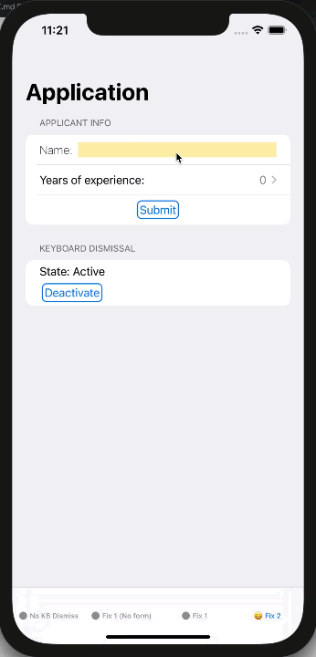

# KeyboardDismissalInSwiftUI

Written using XCode 12.1 and SwiftUI 2.0 for iOS 14.1

# About
The ability to dismiss the keyboard in iOS is a fundamental aspect of user interface design.  Users expect the keyboard to show when tapping an element that takes text input, and it is natural to expect the keyboard to automatically hide as the user interacts with other parts of the user interface (UI).  SwiftUI, Apple's relatively new framework for declarative UI development, does not currently offer a convenient way to manually dismiss the keyboard, making it a bit of a challenge to hide the keyboard when a user taps an area on the screen outside of a text input field.

This demo project illustrates 2 fixes that utilize the responder chain in UIKit to add keyboard dismissal in SwiftUI. For a more detailed explanation please read the accompanying [blog post](https://www.dabblingbadger.com/blog/2020/11/5/dismissing-the-keyboard-in-swiftui).

# License

This project is published under an open source MIT license.  Feel free to use, edit, and modify this code as you please.
